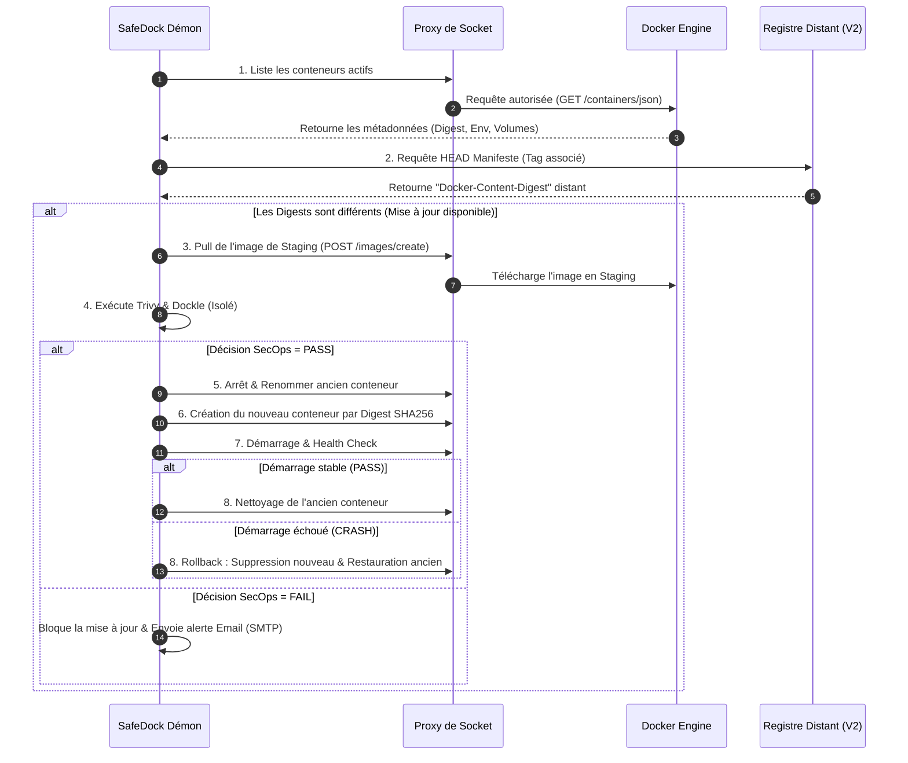

# Architecture Technique de SafeDock 🛡️⚓

Ce document détaille le fonctionnement interne, les flux SecOps et les mécanismes d'orchestration qui font de SafeDock un **pare-feu de déploiement (Gatekeeper)** de confiance pour vos infrastructures Docker.

---

## 1. Vue d'ensemble de l'Architecture

Contrairement aux outils de mise à jour automatiques aveugles (qui tirent les images et relancent immédiatement les conteneurs sans analyse), SafeDock isole le cycle de vie de vos conteneurs en trois étapes étanches : **Vérification passive -> Staging SecOps -> Déploiement Transactionnel**.

---

## 2. Pilier 1 : Isolation & Proxy de Socket

Pour empêcher que le conteneur SafeDock n'ait un accès root illimité sur l'hôte en montant directement `/var/run/docker.sock`, l'architecture impose l'utilisation de `tecnativa/docker-socket-proxy`.

* **Filtrage fin :** Le proxy n'autorise que les requêtes API indispensables (`CONTAINERS=1`, `IMAGES=1`, `NETWORKS=1`, `VOLUMES=1`).
* **Sécurisation en écriture (`POST`) :** 
  * En mode **Audit Passif**, la variable `POST=0` bloque toute altération de l'infrastructure.
  * En mode **Orchestrateur Actif**, `POST=1` est activé pour autoriser SafeDock à instancier les conteneurs de staging et de production. L'accès réseau au conteneur SafeDock doit alors être restreint.

---

## 3. Pilier 2 : Le Pipeline de Staging SecOps

Dès qu'une divergence de Digest SHA256 est repérée, l'image est téléchargée sans perturber le conteneur en cours d'exécution. SafeDock lance alors deux analyses SecOps majeures :

### A. Scan de Vulnérabilités (Trivy CLI)
SafeDock exécute Trivy en tâche de fond pour auditer l'image téléchargée.
* **Extraction :** SafeDock parse le flux JSON produit pour comptabiliser les vulnérabilités par niveau (`Critical`, `High`, `Medium`, `Low`, `Unknown`).
* **Seuils de tolérance :** Si le nombre de failles non corrigées dépasse la politique de sécurité configurée (ex: `SAFEDOCK_MAX_SEVERITY_ALLOWED=HIGH`), la mise à jour est immédiatement avortée.

### B. Linter de Structure & Conformité (Dockle CLI)
SafeDock lance Dockle pour s'assurer que la structure de l'image respecte les bonnes pratiques SecOps :
* **Détection :** Recherche des secrets passés dans l'historique de build (Dockerfile history), des instructions `USER` manquantes (exécution par défaut sous l'utilisateur root), ou de structures de répertoires suspectes.
* **Blocage :** Tout signalement de niveau `FATAL` par Dockle annule immédiatement la mise à jour.

---

## 4. Pilier 3 : Redéploiement Transactionnel & Rollback

Le déploiement d'une image validée s'effectue sous forme de **transaction atomique** pour éliminer le risque d'une coupure de service prolongée si la nouvelle version refuse de démarrer (ex: crash suite à un fichier de configuration corrompu).

1. **Sauvegarde de secours :** L'ancien conteneur est arrêté puis renommé en `[nom-du-conteneur]-rollback`. Son nom d'origine est ainsi libéré.
2. **Instanciation Immuable :** Le nouveau conteneur est créé sous le nom d'origine, mais sa configuration pointe vers son **Digest SHA256 unique** (`image@sha256:...`) et non son tag textuel, le protégeant contre toute modification ultérieure sur le registre.
3. **Phase de Test de Stabilité :** Le nouveau conteneur est démarré. SafeDock attend une période de stabilisation (3 secondes) puis inspecte son état :
   * **Succès :** Le conteneur fonctionne. L'ancienne sauvegarde (`-rollback`) est supprimée définitivement. Le pivot est validé.
   * **Échec (Crash au boot) :** Le nouveau conteneur défaillant est détruit. SafeDock renomme immédiatement l'ancien conteneur de secours à son nom d'origine et le redémarre instantanément. **Le service est rétabli et une alerte Email est envoyée.**
